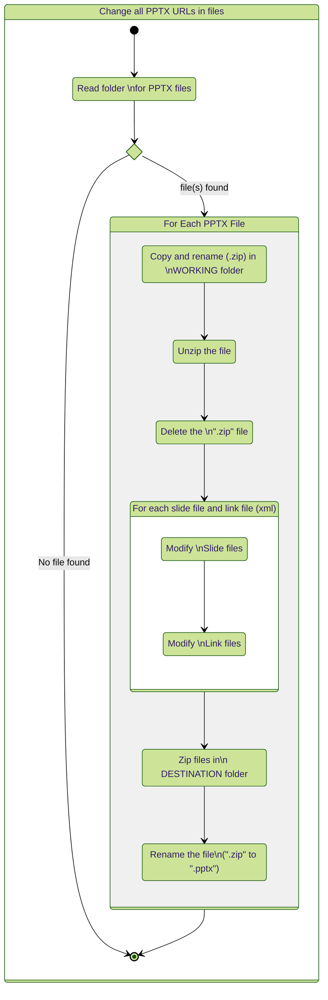

<!-- title: Update-PPTXlinks -->
# Update-PPTXLinks

<div style="text-align: center;">&#128679; This is a work in progress &#128679;

[Paypal Donate](https://www.paypal.com/donate/?business=5LX8QALBQH58U&no_recurring=0&currency_code=EUR)

</div>


## Synopsis
This **PowerShell** script is for changing **URL** inside a **PPTX** file.\
Can change multiple PPTX at a time.\
Can change multiple URL at a time.\
\
This process **does not need** to have **PowerPoint** on the machine where is it executed.
<hr style="width: 33%">

## Process
Process description:



<hr style="width: 33%">

## Install

Download the files.

Unzip the files somwhere.

<hr style="width: 33%">

## Files
There is now 5 files in the folder, see table below.

<details open>
<summary>Table of files</summary>

| Files | Comment
|---|---|
Update-PPTXLinks.ps1  | PowerShell script
Update-PPTXLinks.psd1 | PowerShell Data for parameters
README.md   | Markdown file (documentation)
README.html | HTML file from Markdown
LICENCE | Licence file

</details>

You can rename "README.*" by "Update-PPTXLinks", because may be you can have a lot of README and you want to preserve the How To.

Copy in your PowerShell `Scripts` folder.

```powershell
[yourDocuments]\WindowsPowerShell\Scripts
```


<hr style="width: 33%">

## Configuration required for proper operation

### Folder for work
The folder use to work is:

```
C:\Temp\ChangeLinks
```

If folder **'ChangeLinks'** does not exists you need to create it.\
PowerShell:

```powershell
Set-Location C:\Temp
New-Item -Path . -Name  "ChangeLinks" -ItemType  "directory"
```

Command prompt (Windows):

```cmd
CD C:\Temp
mkdir ChangeLinks
```

Edit the file: `Update-PPTXLinks.psd1` if you want to change this folder name.

<hr style="width: 33%">

### Folders section in the configuration file
All folders are in: **C:\Temp\ChangeLinks**.

If you want to change that, change values below.

    ProjectFolder = 'C:\Temp'
    ProjectChangeLinks = 'ChangeLinks'

Working and Destination folders.

    WorkingFolder = 'WORKING'
    DestinationFolder = 'DESTINATION'

&#10071; These folders are automatically subfolders of: '**C:\Temp\ChangeLinks**'.

The PPTX folders (Do NOT Change)

    SlidesLocation = 'ppt/slides'
    SlidesRelsLocation = 'ppt/slides/_rels'

These folders contain the slides as well as all the links type references of the slide. These are XML files.
<hr style="width: 33%">

### Folders

Structure of the folders below:

```
.[C:\Temp]
└── 📂 ChangeLinks
    │   └── 📄 pptx source files
    ├── 📂 WORKING
    │   └── 📄 files/folders structure of PPTX after unzip
    └── 📂 DESTINATION
        └── 📄 updated pptx files
```

<hr style="width: 33%">

### Change URLs
Change and duplicate as needed the URLs in **AllLinks**.

AllLinks

```
@{
    OldURL = '<URL To change>'
    NewURL = '<New URL>'
}
```

## How To change your PPTX (Configure the parameters)
### Check and change the URLs
Check the config file: **PPTXChanger.pds1**.\
Change the URLs you have to.\
BE AWARE of the ORDER of CHANGE! One at a time.\
You can accidently change something unexpected.

<hr style="width: 33%">

### Copy your PPTX files
Put your PPTX file in this directory: **C:\Temp\ChangeLinks**.\
Except if you have change it.
<hr style="width: 33%">

### Run the script
The best way to run the script is to use the **PowerShell ISE**.

1. Start **PowerShell ISE**
1. Load the script "**Update-PPTXLinks.ps1**"
1. Run.

Comments will appear in the console.
<hr style="width: 33%">

### After running
Your new **PPTX** files are in the '**Destination**' folder in "**ChangeLinks**".\
Check the results.

Save your new PPTX in there final destination.\
**Note**: Each time you start the script, all the files in the **WORKING** and **DESTINATION** directory are deleted first.
<hr style="width: 33%">

# To do
* Verbose mode true/false
* Working Folder as needed
* Create a nice module
  * Improve code, detect folder, etc.
* Server compatibility
* Test on 
* * Mac
* * Linux
* What else ? 

# Donate if you want

<div style="text-align: center;">

[Paypal Donate](https://www.paypal.com/donate/?business=5LX8QALBQH58U&no_recurring=0&currency_code=EUR)

</div>


___